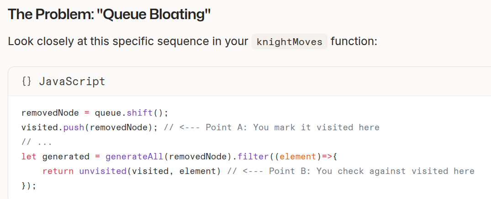
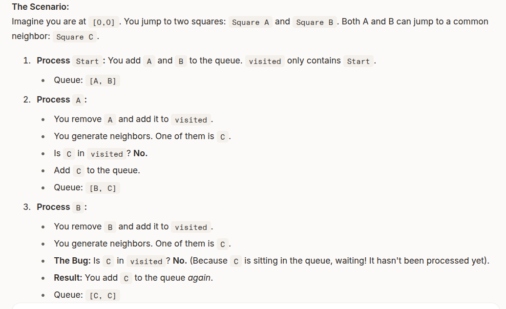
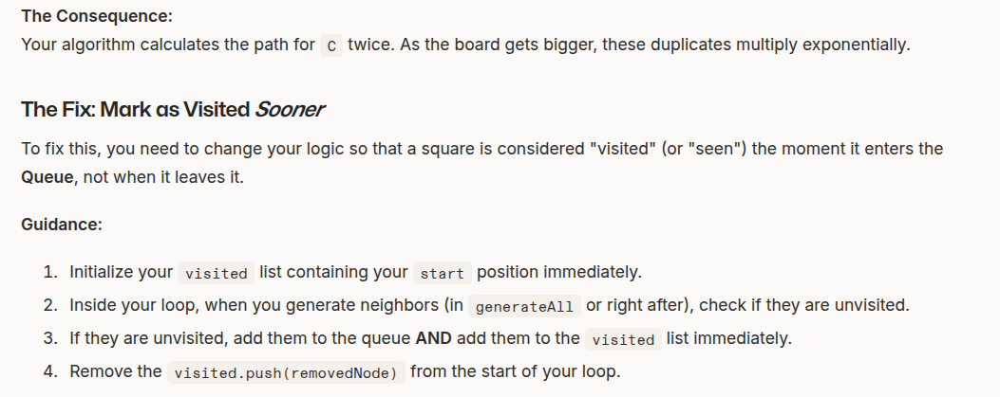

# 1.Mark as visited sooner
a square is considered 'visited' the moment it enters the queue, not when it leaves it

# 2.Set
superpowers: 
1) uniqueness (a value can only occur once in a set. if you try to add a duplicate, it simply ignores you)
2) speed (checking if an item in a Set is instant O(1), whereas checking an array requires scanning the whole list (O(n)))
 1. Create a Set using the 'new' keyword

 //Create an empty Set
 const guestList=new Set();

//Add items using .add()
guestList.add('Alice');
guestList.add('Bob');
guestList.add('Charlie');

console.log(guestList);
//Output:Set(3) {'Alice','Bob','Charlie'}

2. ' No duplicates 'rule
if we try to add 'Alice' again:

guestList.add("Alice"); 
guestList.add("Alice"); 

console.log(guestList);
// Output: Set(3) { 'Alice', 'Bob', 'Charlie' }
// It didn't throw an error, it just silently refused to add the duplicate.

3. Checking for existence (.has)
it returns true or false

if(guestList.has('Bob')){
    console.log('Let him in!');
}

console.log(guestList.has('Dave'));  //false

4. Removing and Clearing
//remove a specific item
guestList.delete('Charlie');  // returns true if successful

//clear the entire set
guestList.clear();  //size becomes 0

5. Checking Size
IMPORTANT: arrays use .length , but Sets use .size

const numbers=new Set([1,2,3]);
console.log(numbers.size);  // 3

6. The 'Object Trap' (curcial for coordinates)
In JS, Primitives (strings,numbers,booleans) are compared by value
Objects (arrays,functions,objects) are compared by Reference (memory address)
eg:
const visitedLocs = new Set();

// We add an array
visitedLocs.add([5, 10]);

// We check for that array... or do we?
console.log(visitedLocs.has([5, 10])); 
// Output: FALSE
Why?
Because the [5, 10] you added is stored at Memory Address A.
The [5, 10] you are checking is a new array created at Memory Address B.
To the Set, they are two completely different things.

Solution:Primitives (strings)
to track coordinates effectively in a Set, you usually convert them to a string first

const vistedLocs=new Set();
const x=5;
const y=10;

//turn it into a string format, like "5,10"
const coordString=`${x},${y}`;

//Add the string
visitedLocs.add(coordString);

//check the string
console.log(visitedLocs.has("5,10"))    //TRUE

# 3..toString()
if you call .toString() on an array like [3,3],JS automatically converts it to "3,3"